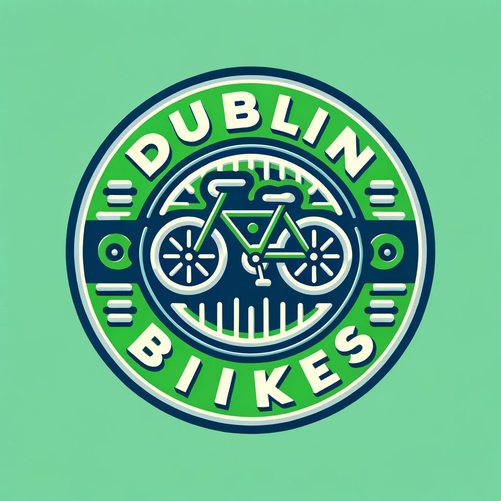
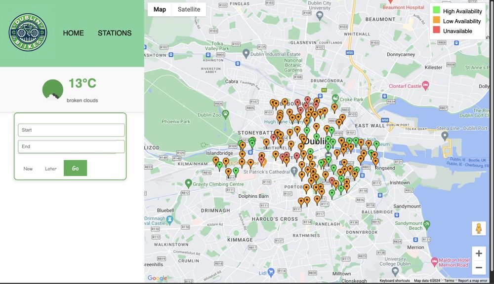

# DUBLIN BIKES

## Introduction  
This project provides a comprehensive platform for Dublin's bike-sharing information, dedicated to eradicating the need for any additional resources when utilizing shared bikes and promoting green transportation. It integrates real-time status and predictive availability information for all shared bike stations in Dublin. Moreover, it integrates Google Maps to navigate users on their biking journeys. The application calculates the carbon dioxide reduction for each ride comparing to driving, giving you a tangible sense of your contribution to the environment.  
  
## Technical Guide:  
The project is deployed on EC2 and uses RDS to host the database. With Flask as its framework, it integrates front-end and back-end services, data analysis, and machine learning modules. The main technologies involved in this project include Flask, Python, SQLAlchemy, PyMySQL, and scikit-learn.   
  
The environment for running the project has been exported in the environment.yml file, which is located in the root directory.  
  
## View Our Web:  
Our website address is: http://13.48.194.24:8080.  
Currently, our website is not open to all IPs and can only be opened in eduroam. If you are interested in our application, please contact us with your IP address, and we will set up access permissions for you.  
  
The website layout is as follows:  
  
  
## Project Documentation:  
If you're interested in our development process, please read the project report on GitHub. The report provides a detailed description of the project's architecture, implementation technology, and development process.  
  
## Contact us:  
@bingyang01: bingyang.li@ucdconnect.ie  
@zack760: maxim.istasse@ucdconnect.ie  
@superfish315: haoyu.zheng@ucdconnect.ie  
